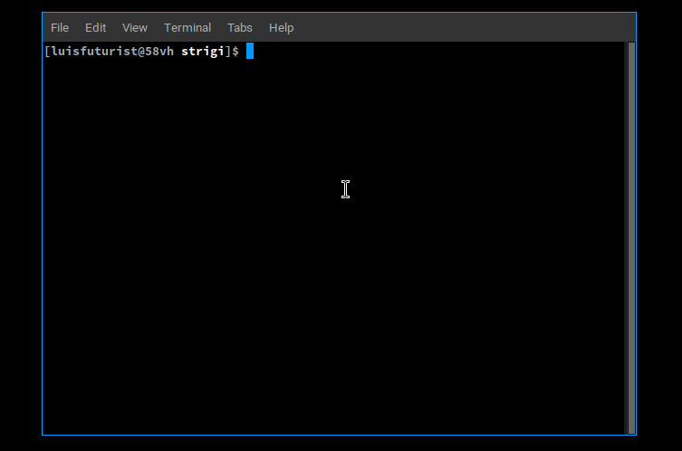

In a hurry to get started? Jump right to the [Installation](../guide/installation) to set up Strigi on your system.

# Introduction

Strigi is a free and open-source AI assistant that works within your command line. It helps you with various command-related tasks, like generating commands based on your instructions and explaining existing ones in a clear way.

:::warning ⚗️ Experimental

Strigi is under development and utilizes experimental AI technology. While it strives to provide accurate and helpful assistance, its responses may not always be perfect.

:::

## Goals

- **Simplify CLI interaction**: Strigi aspires to bridge the gap between users and the command line by transforming natural language into corresponding CLI commands, removing the need for extensive memorization of complex syntax.
- **Enhance command understanding**: Strigi strives to go beyond mere command generation. It seeks to empower users by providing detailed explanations for existing commands, fostering a deeper understanding of their functionalities and purposes.
- **Boost user productivity**: By streamlining command generation and explanation, Strigi aims to expedite workflows and enhance user productivity within the command line environment.

## Scope

Strigi's primary focus lies on assisting users with:

* **Natural Language Command Generation:**  Create commands effortlessly by describing your desired actions in plain English.
* **Interactive Command Refinement:** Review and customize generated commands for accuracy and personal preferences.
* **Seamless Command Execution:** Directly run generated commands without the need for manual copying and pasting.
* **In-Depth Command Explanations:** Gain a clear understanding of existing commands and their functionalities.
* **User-Tailored Responses:** Provide instructions to shape Strigi's responses and optimize your workflow.

## Requirements

- **Basic understanding of command line interface (CLI)**: While Strigi strives to be user-friendly, some familiarity with the command line will be beneficial for interacting with the tool.
- **Gemini API key**: Authentication using a Gemini API key is essential to unlock core functionalities within Strigi.
- **An internet connection**: Access to an internet connection is imperative for Strigi's core functionalities, as it relies on connectivity to utilize the Gemini API.

## Project Management

We believe in transparent project management. If you’re curious about Strigi’s development process, upcoming features, or brainstorming sessions, we invite you to explore our approach. Visit our [Project Management section]([./CONTRIBUTING.md#project-management](https://github.com/neogaialab/strigi/blob/main/CONTRIBUTING.md#project-management)) for a closer look at how we plan, build, and evolve Strigi.
